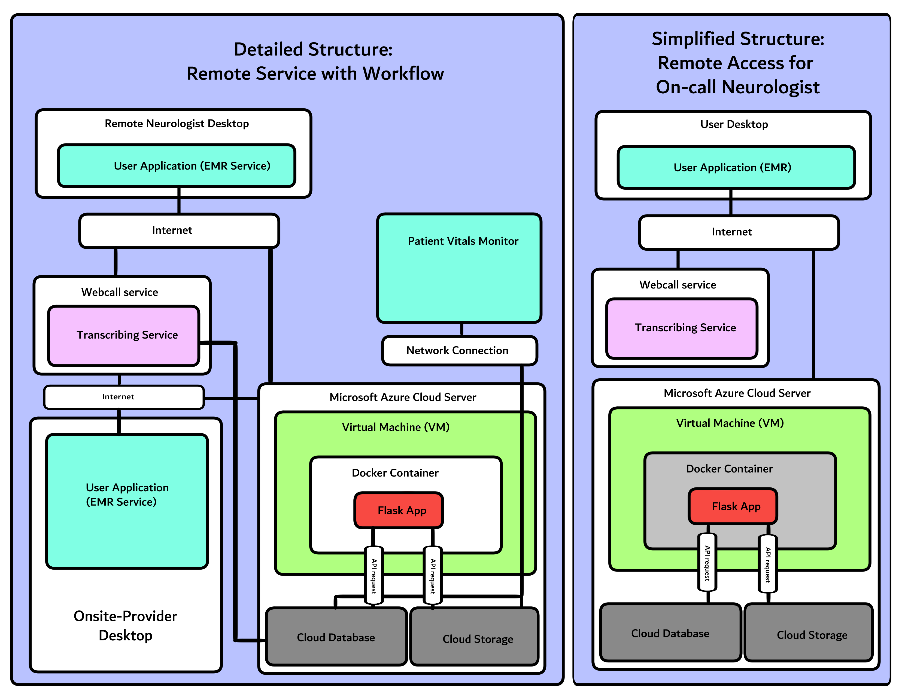

### Architecture Diagram 

### 1. Service mapping 

|Layer|Service|Role description|Related content (Module or Assignment)|
|---|---|---|---|
|Storage|Azure Storage|To store patient data such as images and documents (DICOM and JPEG) Secondary use for storing larger volumes of infrequently used data for lower cost|Module 6 - Storage|
|Database|Azure SQL|To store patient data such as numeric values (vitals) and clean tables. |Module 7 - Databases & Assignment 4: Managed vs Manual deployment|
|Compute|Azure Container Storage|To run flask application inorder to process and display information|Assignment 2- VM’s and working with flask|
|Docker|Azure Contianer Instance|To ensure consistency across multiple environments and to enable efficient updates for bug and security patches|Module 10 - Docker|
|AI *optional|Transcribing service|To automate and record speech into text output during voice call for documentation purposes.*must be supervised|Assignment 9 - AI ML|

### 2. Data flow narrative

During an on-call remote shift, the neurologist would be on-call in case of emergency with both their phone and desktop on during the shift. A remote consultation would proceed as follows.
1. The remote Neurologist would log into the User application via their device while speaking to Primary providers on the webcall service.
    During this call, the webcall service would transcribe dialog for recording, educational and documentation purposes
    Transcribed dialogue by artificial intelligence would then be saved temporarily as a file to be uploaded into the server’s cloud service. 
2. During this call Primary provider and staff would upload files into the patient's EMR in the cloud service. 
    Uploaded files would be stored to respective locations as follows: 
        Database: Vitals, Medication list, Charting (Assessment, Glasgow Coma scale, etc.)  
        Storage: CT scan imaging, progress note, and other related documents
3. Scheduled service would then load the files into the respective locations.
4. The API would then load and run back data such as vitals into tables. 
5. The Flask app would then display the files on the neurologist’s desktop.
6. The neurologist would then upload consultation documents into the patient’s EMR which would include recommendations based on CT evaluation and clinical findings.  

### 3. Security, identity, and governance basics

Environment variables would only be managed and accessed by verified admin for credential management. This is so the hospital and remote healthcare agency’s IT department can properly designate credentials to the neurologist’s account. This ideally would be through a microsoft office work account associated with the hospital system for logging into the EMR system. By utilizing access under a microsoft account multiple areas would be covered such as security and verification. Microsoft accounts often require multi-factor authentication for access to user accounts which can act as a deterrent against security issues and decrease risk of leaking PHI. Microsoft Azure servers also track user IP addresses for suspicious activity. Having a docker would also help in isolating applications so that there is isolation of dependencies which decreases potential damage of security issues. 
For the remote neurologist account, the account would have access to upload and read files. However, the neurologist would not be able to edit or delete files made by others and can only edit or delete files uploaded themselves.  Accounts within an EMR system are typically role based. For example, the EMR permissions for a medical assistant would include vitals sign inputs but not include the Medication records. 

In regards to transcription service use, the medical transcription service for webcall must have hipaa-compliance and be supervised by admin to ensure compliance. Alternatively, an in-person scribe may be used for transcribing dialogue of the call which are often used in emergency room settings to alleviate workload of physicians.    

### 4. Cost and operational considerations

The most costly component of this project would likely be the computer component. This is due to high volume and availability requirements in case of emergency. The compute component should not be able to be scaled to zero and must be running at all times. Also due to the remote setting, availability in multiple zones may be required which can increase the cost. Serverless jobs that may be scheduled would be maintenance tasks such as back up for databases and storage and clearing temporary files. For example, for a patient’s vitals on the portable monitors if a blood pressure is not recorded or saved within 48 hrs, it may be wiped from the system. 

Due to the scaling of this project, there are very minimal choices to enable this project to remain within a student budget. One of the only applicable sections that is the most feasible to remain within a student budget would be the patient vitals output into flask for the neurologist or primary provider to view. The application would be able to run on a low-cost tier and can run with scheduled jobs to either clear or archive vitals outputs.
