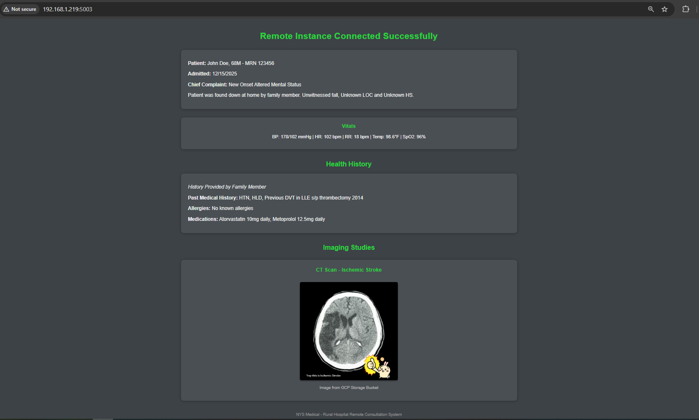
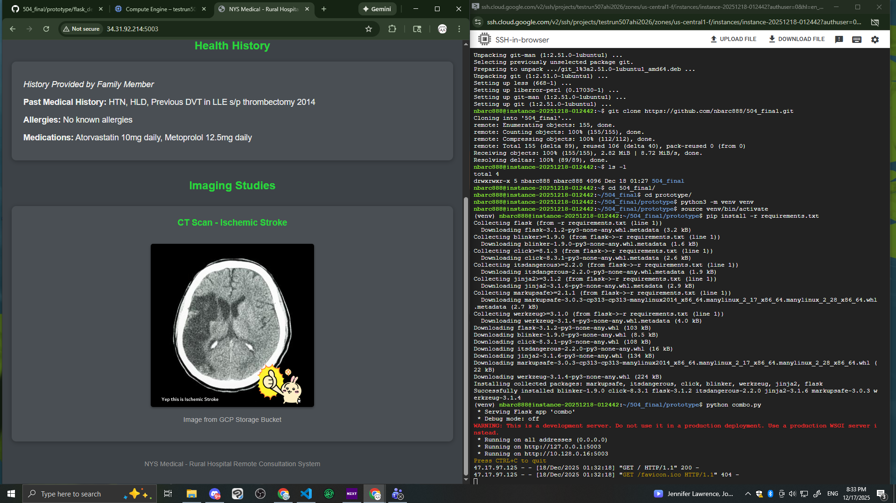

At this Current time(12/17/25 8:30pm EST): GCP VM is now functional with deploying flask app 

However when running the Python Script in VS Code Terminal, code is functional and able to launch flash app and connect to Bucket. 

Primary methodology is to use flask app to display an image from a GCP bucket which can bee seen in '504_final_opt.ipynb' which is a notebook that can connect to both the VM and the google bucket. 

|Code|Description|Functionial Status|
|---|---|---|
|app.py|Base text output via flask| CONFIRMED WORKS VIA TERMINAL |
|combo.py|Combined text with image| Confirmed works in terminal |
|image.py|image only that connects with GCP bucket Public link| CONFIRMED |  







Log into Azure 

Create Virtual Machine with Following items:
Region - US - East US
Availability Zone 3
Image : Ubuntu Server 24.04 LTS x64 Gen2 
VM architecture x64
Size: Standard_F1s- 1 vcpu, 2 GiB memory (36.28 USD/monthly)

Admin account
username: dog
password: German$hepherd

Allow Selected port: SHH (22)

----------------

### Due to Price variability between both Azure and GCP, GCP was selected to run prototype. 


For GCP VM instance
Machine and size: E2-small 
US-east4 - Northern Virginia
### connect access to all cloud APIs

#### For GCP VM Bucket
name: instance-dog-279783831978

##### Navigate to your bucket:

In the Google Cloud Console, go to Cloud Storage and then to the Buckets page.
Click on the name of the bucket that contains your JPG file (e.g., instance-dog-279783831978 ).

Access Permissions:
Once inside the bucket, click on the Permissions tab.

Grant Public Access:
In the Permissions section, click the Grant access button.
In the "New principals" field, type allUsers . This principal represents anyone on the internet.
In the "Select a role" dropdown, search for and select Storage Object Viewer . This role grants read-only access to objects.

Click Save.

A confirmation dialog will appear. Click Allow public access .

Verify and Get the Public URL:
Go back to the Objects tab within your bucket.

You should now see a "Public access" column for your objects. The JPG file you want to share should indicate "Public to internet" and have a Copy URL button next to it.
Click the Copy URL button to get the public URL for your JPG file.


### SHH = GCP Directions: 
Insert following codes
```bash
sudo apt update 
```
```bash
sudo apt install python3 python3-pip python3-venv
```
```bash
sudo apt install git
```
```bash
git clone https://github.com/nbarc888/504_final.git
```
```bash
ls -l
```
```bash
cd 504_final/
```
```bash
ls -l
```
```bash
cd prototype/
```
```bash
python3 -m venv venv
```
```bash
source venv/bin/activate
```
```bash
pip install -r requirements.txt
```
```bash
python ### any pythonscripts
```

Azure directions

Quick Start for Github

```bash
git clone https://github.com/Azure-Samples/msdocs-python-flask-webapp-quickstart
```

To run locally on device 
```bash
cd msdocs-python-flask-webapp-quickstart
```
```bash
py -m venv .venv
.venv\scripts\activate
```
```bash 
pip install -r requirements.txt
```
```bash
flask run prototype/app.py
```