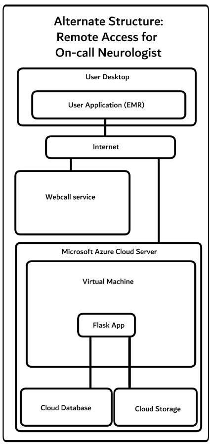

### 1. Which parts of the design you feel most confident about, and which parts you are least sure about?

The areas of the design that I have a high confidence in are flask app utility and accessibility to storage and database. Flask app would be utilized by both the neurologist and primary provider in order to view and access patient documents. If design is successful in clinical application, hospitals lacking resources would be able to access other specialties for consultation services. Areas that need further development would be the optional transcribing service that utilizes artificial intelligence. While there are a few AI-based scribing services available, ensuring HIPAA compliance and maintaining service licenses is relatively complicated. There would also be potential issues with AI-based transcribing services with the AI creating errors in documentation.  

### 2. At least one alternative architecture you considered and why you did not choose it. 
One alternative architecture that was considered is as follows as below:

Primary differences include no transcription service and no docker container. Reasons why this was modified is as follows: 
In regards to transcription service, transcription service is necessary for communication using most forms of digital device so that there could be active record of conversation. These types of services are required for both documentation and legal purposes. Similar use can be seen for medical translation remote services. Reason for inclusion in primary design was for practical utility so that both medical providers have access to record of the call. 
The docker container was included in order to provide uniformity for both the remote neurologist and primary provider. The docker provides an extra level of assurance that the environment, dependency and related code is able to run on both the neurologist and provider’s local machine. 

### If you had 4–8 more weeks and unlimited credits, what next steps you would implement?
If there was additional time and resources allocated, the next steps to implement include the following:  
1. Increased zone availability to enable better remote capability. This would decrease connection lag if a user from Arizona needed to connect into a service hosted in Northern Virginia. 
2. Working interface that can simultaneously upload and display realtime data for patient EMR for on-call neurologist. 
For long term management and development:
Further work into HIPPA compliance and machine learning for AI transcription service regarding online call systems. It would realistically take months to years in order to properly train AI to accurately transcribe dialogue from medical consult webcalls. During development, human supervision through admin is required.  Scheduled storage clearing for files created by the transcription service would have to be scheduled to decrease storage requirements. However for initial development and phases, reinforcement learning from human input would be used to train the AI prior to implementation. Ideally the model would learn from corrections after revision and reviews from developers to correct mistakes. Examples fed into training the AI would not come directly from real patient data but from case study examples created for medical education purposes. 
